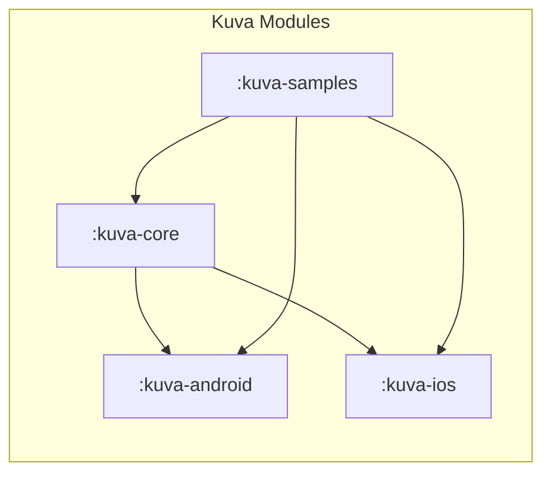
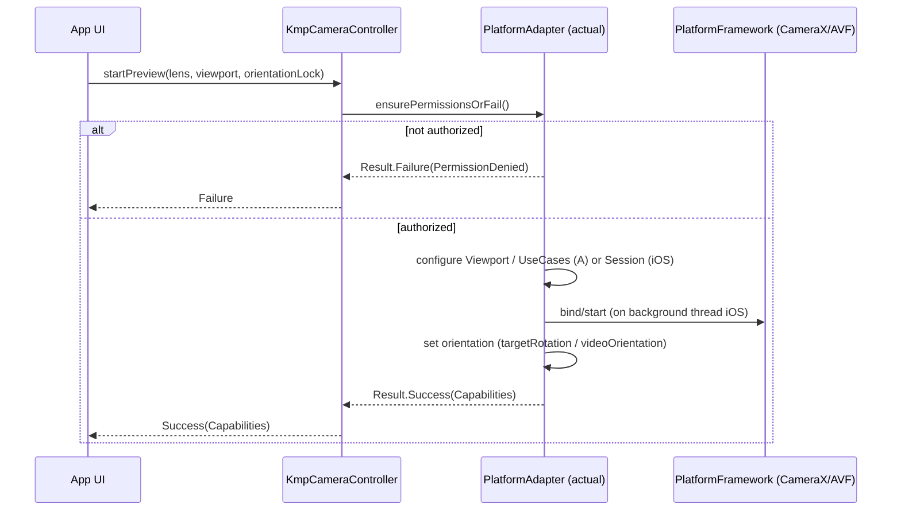
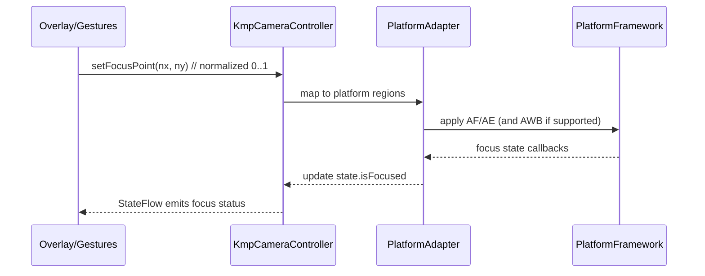
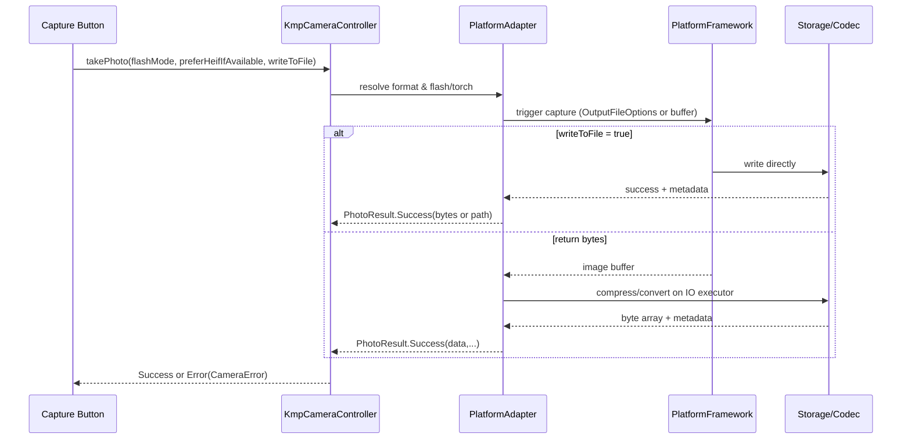
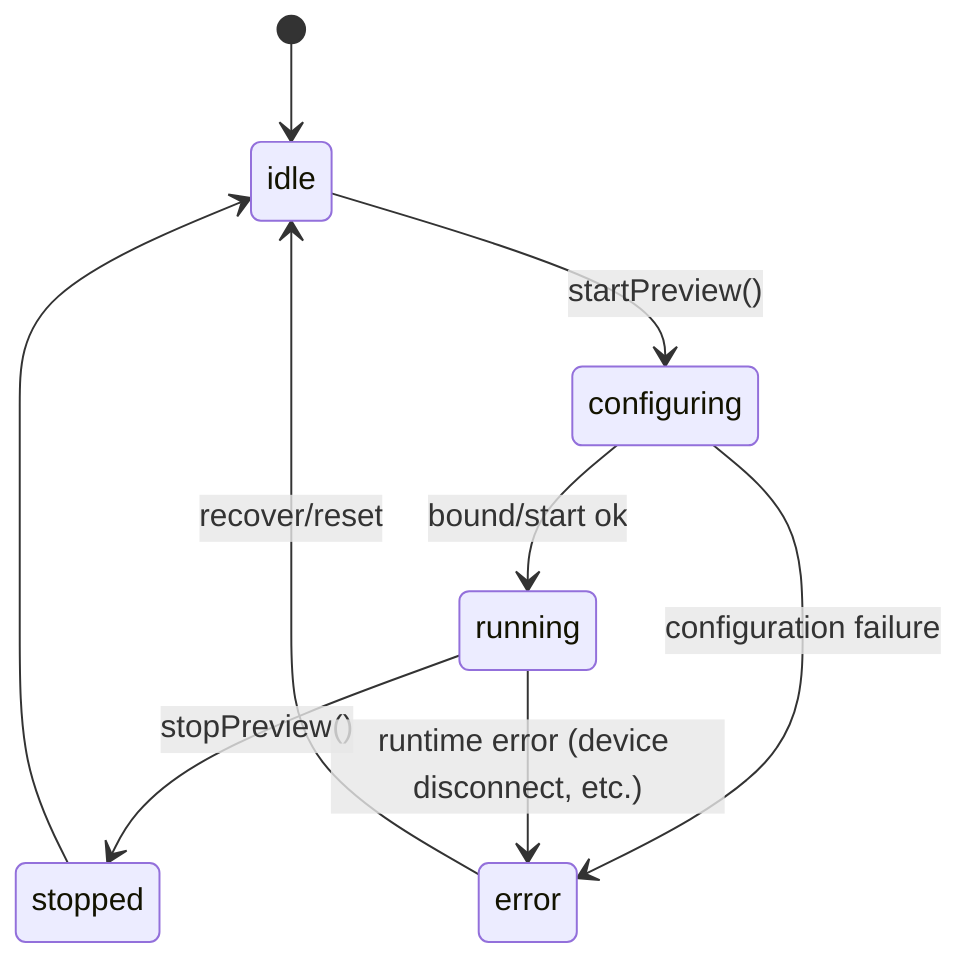
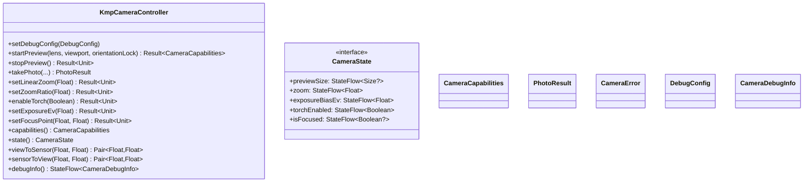
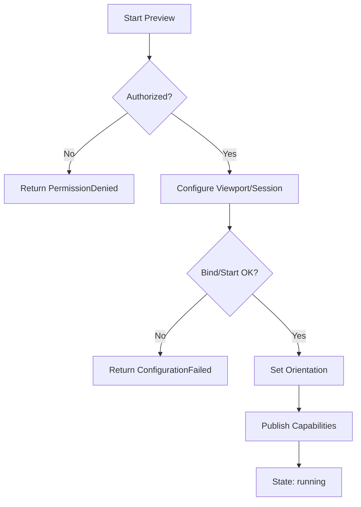
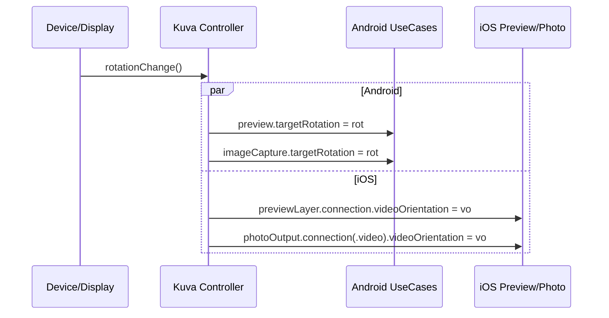

# Kuva — Architecture (CUPID-aligned)

Kuva is a Kotlin Multiplatform (KMP) camera library that unifies Android CameraX and iOS AVFoundation behind one predictable, capability-driven API focused on preview and photo capture with first-class controls, viewport alignment, and diagnostics.

---

## 1) Goals & Scope

### Primary goals
- Cross-platform preview + photo capture with aligned viewport/crop
- Unified controls: tap-to-focus, zoom, EV, torch/flash
- Normalized coordinates (0..1) and linear zoom
- Explicit lifecycle (startPreview/stopPreview) and orientation control
- Diagnostic mode (FPS, stalls, negotiated sizes), zero-overhead in release

### Out of scope for v0.1
- Video capture
- RAW/Pro features
- On-device ML overlays (face, barcode, etc.)

---

## 2) CUPID Principles

- **Composable**: Core API is small and pluggable; overlays/gestures are opt-in. Debug diagnostics can be added/removed without affecting capture.
- **Unix Philosophy**: Each module does one thing well `:kuva-core` (API), `:kuva-android` (CameraX), `:kuva-ios` (AVFoundation), `:kuva-samples` (demo).
- **Predictable**: Explicit start/stop, capability queries, Result<T> and CameraError for all ops, stable coordinate mapping.
- **Idiomatic**: Uses idioms of CameraX/AVFoundation under the hood; StateFlow for reactive UI; Compose-friendly overlay slot.
- **Domain-based**: Models camera domain concepts (lens, exposure, viewport, capture) directly; capability flags map real device features.

---

## 3) High-Level System Overview

```mermaid
graph TD
  A[App UI (Compose MPP)] -->|calls| B[Kuva Core (commonMain)]
  B -->|expect/actual| C1[:kuva-android (CameraX)]
  B -->|expect/actual| C2[:kuva-ios (AVFoundation)]
  C1 --> D1[Android Camera HAL via CameraX]
  C2 --> D2[iOS Camera via AVFoundation]
  B --> E[StateFlow (CameraState, DebugInfo)]
  A -->|overlays/gestures| E
```

---

## 4) Modules & Packaging



### Responsibilities
- **:kuva-core**: public API, models, error types, controller expect class
- **:kuva-android**: actual impl via CameraX; ViewPort/UseCaseGroup; mapping helpers
- **:kuva-ios**: actual impl via AVFoundation; preview layer + connection orientation
- **:kuva-samples**: demo app, focus ring overlay, pinch zoom, debug HUD

---

## 5) Public API (commonMain)

```kotlin
// Core models (abridged)
data class Size(val width: Int, val height: Int)
data class EvRange(val minEv: Float, val maxEv: Float, val stepEv: Float?)
data class ZoomRange(val min: Float, val max: Float)
data class Viewport(
    val aspectRatio: Float, 
    val scaleToFill: Boolean = true, 
    val alignCropToAllOutputs: Boolean = true
)

enum class LensFacing { BACK, FRONT }
enum class FlashMode { OFF, ON, AUTO }
enum class OrientationLock { AUTO, PORTRAIT, LANDSCAPE }

data class CameraCapabilities(
  val hasFlash: Boolean,
  val hasTorch: Boolean,
  val supportsTapToFocus: Boolean,
  val supportsExposurePoint: Boolean,
  val supportsExposureCompensation: Boolean,
  val exposureRange: EvRange?,
  val zoomRange: ZoomRange?,
  val supportsLinearZoom: Boolean,
  val minZoom: Float = 1f,
  val supportsManualFocus: Boolean,
  val supportsRawCapture: Boolean = false,
  val supportedEffects: Set<String> = emptySet()
)

sealed class CameraError { /* PermissionDenied, CameraUnavailable, ... */ }

sealed class PhotoResult {
  data class Success(
    val data: ByteArray,
    val width: Int, val height: Int,
    val mimeType: String,
    val metadata: Map<String, Any?> = emptyMap()
  ) : PhotoResult()
  data class Error(val error: CameraError) : PhotoResult()
}

interface CameraState {
  val previewSize: kotlinx.coroutines.flow.StateFlow<Size?>
  val zoom: kotlinx.coroutines.flow.StateFlow<Float>           // 0..1
  val exposureBiasEv: kotlinx.coroutines.flow.StateFlow<Float> // EV
  val torchEnabled: kotlinx.coroutines.flow.StateFlow<Boolean>
  val isFocused: kotlinx.coroutines.flow.StateFlow<Boolean?>
}

data class DebugConfig(
  val enabled: Boolean = false,
  val analyzeFps: Boolean = true,
  val targetAnalysisResolution: Size = Size(640, 480),
  val windowSeconds: Int = 3
)

data class CameraDebugInfo(
  val sessionState: String, val activeDevice: String?,
  val actualPreviewResolution: Size?, val actualCaptureResolution: Size?,
  val fps: Double, val droppedStallCount: Int, val lastError: CameraError? = null
)

expect class KmpCameraController {
  fun setDebugConfig(config: DebugConfig)

  suspend fun startPreview(
    lensFacing: LensFacing = LensFacing.BACK,
    viewport: Viewport,
    orientationLock: OrientationLock = OrientationLock.AUTO
  ): Result<CameraCapabilities>

  suspend fun stopPreview(): Result<Unit>

  suspend fun takePhoto(
    flashMode: FlashMode = FlashMode.AUTO,
    mirrorFrontCamera: Boolean = false,
    preferHeifIfAvailable: Boolean = false,
    writeToFile: Boolean = false,
    jpegQuality: Int? = null
  ): PhotoResult

  fun setLinearZoom(normalized: Float): Result<Unit> // 0..1
  fun setZoomRatio(ratio: Float): Result<Unit>
  fun enableTorch(enabled: Boolean): Result<Unit>
  fun setExposureEv(ev: Float): Result<Unit>
  fun setFocusPoint(nx: Float, ny: Float): Result<Unit> // 0..1

  fun capabilities(): CameraCapabilities
  fun state(): CameraState
  fun viewToSensor(x: Float, y: Float): Pair<Float, Float>
  fun sensorToView(x: Float, y: Float): Pair<Float, Float>

  fun debugInfo(): kotlinx.coroutines.flow.StateFlow<CameraDebugInfo>
}
```

---

## 6) Key Sequences

### 6.1 Start Preview (permissions, bind, orientation)



### 6.2 Tap-to-Focus (normalized coordinates)



### 6.3 Take Photo (bytes/file, flash/torch rules)



---

## 7) Controller State Machine



---

## 8) Platform Implementations (actual)

### Android (CameraX)
- PreviewView + UseCaseGroup(ViewPort) for preview/capture alignment
- CameraControl for linear zoom, torch, focus/metering; ExposureState for EV range/index mapping
- Rotation: update targetRotation for both Preview and ImageCapture
- Diagnostics: optional ImageAnalysis (small res, keep-latest) for FPS/stall timing
- Threads: single-thread executor for IO (encoding/writes), main thread for UI

### iOS (AVFoundation)
- AVCaptureSession + AVCapturePhotoOutput + AVCaptureVideoPreviewLayer
- Orientation: update both previewLayer.connection?.videoOrientation and the photo connection's videoOrientation
- Focus/Exposure: set POIs (0..1), modes if supported
- Diagnostics: optional AVCaptureVideoDataOutput (timestamps only)
- Threads: configure/start session off main; layer updates on main

---

## 9) Viewport & Coordinate Mapping

```mermaid
flowchart LR
  V[Overlay Tap (x,y) in View coords]
  N[Normalize to 0..1]
  M[Map to Sensor Region]
  A[Apply AF/AE]

  V --> N --> M --> A

  subgraph Android
    direction TB
    P1[PreviewView] --> P2[MeteringPointFactory]
  end

  subgraph iOS
    direction TB
    L1[AVCaptureVideoPreviewLayer] --> L2[metadataRect conversion]
  end
```

**Guarantee**: With Android ViewPort/UseCaseGroup and iOS preview layer gravity + rect conversions, what users tap and what the camera measures align with the capture crop.

---

## 10) Error Handling & Predictability

- All public ops return `Result<T>` or `PhotoResult.Error(CameraError)`
- Platform exceptions map to domain errors:
  - `PermissionDenied`, `CameraUnavailable`, `ConfigurationFailed`, `CaptureFailed`, `FileIO`, `Unsupported`, `IllegalState`, `Timeout`, `Unknown`
- No silent failures; errors propagate to UI via results and `debugInfo().lastError`

---

## 11) Diagnostics (Debug Mode)

- Off by default; hard-disabled in release builds
- **Android**: tiny ImageAnalysis to count frames (FPS) & detect stalls (>250ms gaps)
- **iOS**: AVCaptureVideoDataOutput delegate for timestamps only
- `CameraDebugInfo` exposed via StateFlow
- Optional HUD in `:kuva-samples`

---

## 12) Threading & Lifecycles

- **Common**: explicit `startPreview()` / `stopPreview()` (no hidden lifecycles)
- **Android**: bind/unbind to a provided LifecycleOwner (hosted by platform view). IO executor for encoding/writes. Main for UI.
- **iOS**: session configuration & `startRunning()` on background queue; AVCaptureVideoPreviewLayer updates on main.

---

## 13) Security, Privacy, Permissions

- Do not capture without permission
- **Android**: CAMERA permission; legacy storage only if needed (discouraged)
- **iOS**: `AVCaptureDevice.authorizationStatus(.video)`; suspend start until authorized
- No analytics or tracking; debug mode does not persist PII

---

## 14) Performance Considerations

- Prefer direct-to-file to avoid big byte arrays (Android OutputFileOptions; iOS file representation)
- Prefer HEIF on iOS (`preferHeifIfAvailable`) for 40–50% smaller files
- Use balanced/speed photo quality prioritization where possible
- Keep analyzers tiny; `KEEP_ONLY_LATEST` on Android, `alwaysDiscardsLateVideoFrames` on iOS
- Reuse executors; avoid per-capture thread churn

---

## 15) Extension Points

- **Effects/Extensions**: expose supported labels (e.g., "hdr","night"), app decides
- **File writers**: plug custom sinks (e.g., encrypted storage) behind `writeToFile`
- **Overlay**: arbitrary drawing & gesture input; coordinate helpers provided
- **Permissions**: integrate with caller's KMP permissions layer if desired

---

## 16) Testing Strategy

- **Unit**: EV index math, zoom normalization, error mapping, coordinate transforms
- **Instrumented**: focus/tap alignment golden tests across orientations
- **Soak**: burst 20 captures; monitor memory & stall counts
- **Matrix**: multiple Android OEMs (Pixel/Samsung/OnePlus), multiple iOS devices
- **Permissions**: denied → Settings → granted → resume flows

---

## 17) Versioning & Compatibility

### Semantic Versioning:
- **0.x**: API may evolve; binary compatible within patch for same minor
- **1.0**: API stable; additive features only in minors

### Platform Baselines:
- **Android**: API 21+ (CameraX baseline)
- **iOS**: iOS 14+ (tunable)

---

## 18) Risks & Mitigations

| Risk | Mitigation |
|------|------------|
| OEM quirks (AF/AE regions, EV ranges) | Capability queries; degrade to safe no-ops; targeted device tests |
| Orientation mismatches | Dual-update pattern (Android targetRotation, iOS both connections) |
| Memory spikes on capture | Direct-to-file path; HEIF; IO executor; backpressure |
| Permission edge cases | Suspend until authorized; explicit error returns |
| Diagnostic overhead | Disabled by default; small frames; timestamps only |

---

## 19) Reference Class Diagram (Conceptual)



---

## 20) Developer Experience (DX) Notes

- **Compose-first**: ship a `KuvaPreview` composable that hosts the platform view and an overlay slot
- **Provide sample overlays**: focus ring, rule-of-thirds grid, horizon level line
- **Helper utilities**: pinch-to-zoom gesture → normalized linear zoom

---

## 21) Roadmap

- **v0.2**: Video capture parity, image analysis API (YUV/planes), simple ML overlay hooks
- **v0.3**: RAW capture (where supported), extension effects surfaced as capabilities
- **v1.0**: Stabilize public API, expand samples, full docs & recipes

---

## Appendix A — Start Preview Flow (Decision)



---

## Appendix B — Orientation Update (Dual-update Pattern)



---

Kuva keeps the API small, predictable, and domain-true, while giving you deep control where it matters. The diagrams and flows above are production-focused and map directly to the concrete Android/iOS implementations.